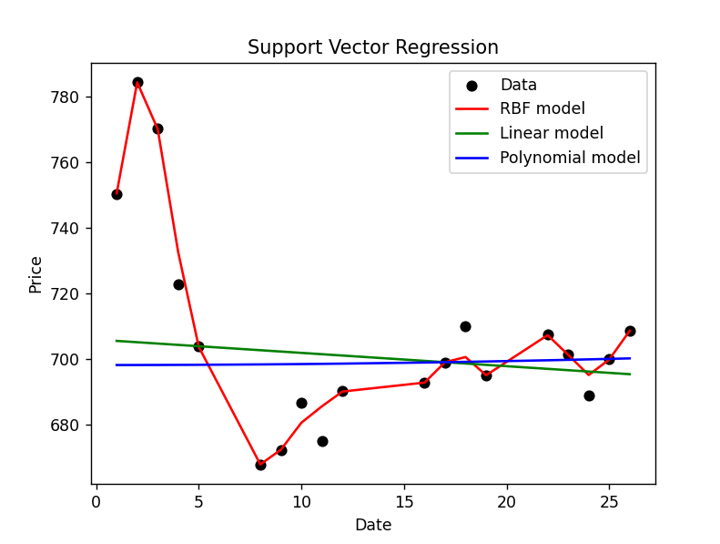

# regression_stock_prediction

The regression equation is solved to find the coefficients, by using those coefficients we predict the future price of a stock.
Regression analysis is a statistical tool for investigating the relationship between a dependent or response variable and one or more independent variables.

Toy example for learning how to combine numpy, scikit-learn and matplotlib. Can be extended to be more advanced.

rbf kernel = e^(-(||X - ||^2)/2*σ^2)
polynomial kernel = (c+X_1^T*X_2)^b          note: here c is a constant and b = degree of kernel
linear kernel = m*x+c

